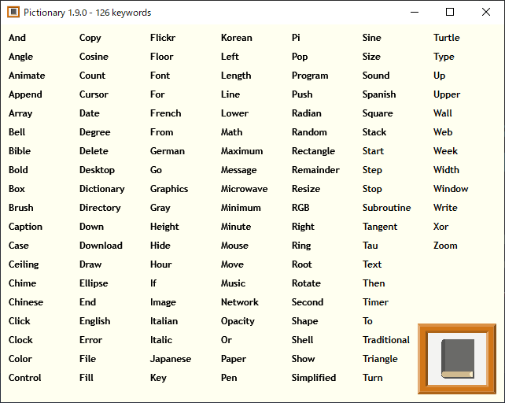

# ピクショナリー

「Small Basic のためのピクショナリー」は非ネイティブの子どもたちのために Small Basic に出てくる英単語を絵で表すというプロジェクトです。

## ダウンロード
[Releases](https://github.com/nonkitMac/Pictionary/releases) から .zip ファイルをダウンロードします。

## 使い方
1. Pictionary.exe を実行します。
1. プログラムの中のキーワードをクリックします。

## システム動作環境
- Windows Vista 以降
- .NET Framework 4.5 以降
- Small Basic 1.2（dll は .zip に含まれます）
- LitDev Extension 1.2 以降（.zip に含まれます）

## ドキュメント
- [ピクショナリー ドキュメント](https://nonkitmac.github.io/Pictionary/Documents-ja)

## クレジット
Made with Small Basic バッジは [rockycodeshimhe-1332](https://docs.microsoft.com/en-us/answers/questions/210063/guys-i-made-a-nice-small-basic-github-badge.html) によりデザインされました

## 関連リンク
- [Small Basic](https://smallbasic-publicwebsite.azurewebsites.net/)（オフィシャルサイト）
- [Small Basic のためのピクショナリープロジェクト](https://nonkitmac.github.io/Pictionary/README-ja)（コンセプト）
- [Small Basic のためのピクショナリー](https://nonkitmac.github.io/Pictionary/Gallery.html)（絵）

## 他の言語
- [English](README.md)
