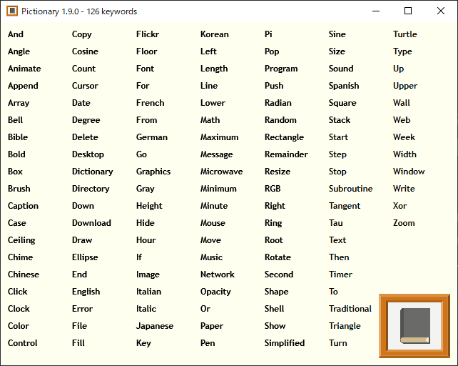

# Pictionary

Pictionary for Small Basic is a project to show pictures about English keywords in Small Basic for non-native kids.

## Download
Download a .zip file from [Releases](https://github.com/nonkitMac/Pictionary/releases).

## Usage
1. Run Pictionary.exe .
1. Click keyword in the program.

## System Requirements
- Windows Vista or later
- .NET Framework 4.5 or later
- Small Basic 1.2 (dll included in .zip)
- LitDev Extension 1.2 or later (included in .zip)

## Documents
- [Pictionary documents](https://nonkitmac.github.io/Pictionary/Documents)

## Credit
Made with Small Basic badge is designed by [rockycodeshimhe-1332](https://docs.microsoft.com/en-us/answers/questions/210063/guys-i-made-a-nice-small-basic-github-badge.html)

## Reference
- [Small Basic](https://smallbasic-publicwebsite.azurewebsites.net/) (official site)
- [Pictionary Project for Small Basic](https://nonkitmac.github.io/Pictionary/) (concept)
- [Pictionary for Small Basic](https://nonkitmac.github.io/Pictionary/Gallery.html) (images)

## Other Languages
- [日本語](README-ja.md)
