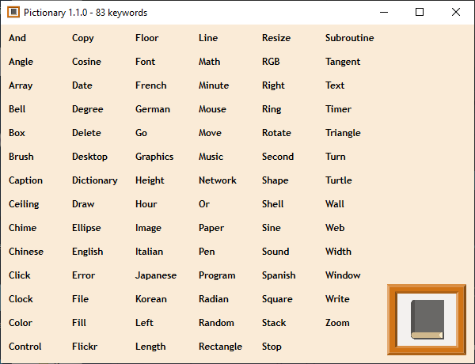

# Pictionary
Pictionary for Small Basic

## Download
Download a .zip file from [Releases](https://github.com/nonkitMac/Pictionary/releases).

## Usage
1. Run Pictionary.exe .
1. Click keyword in the program.

## System Requirements
- Windows Vista or later
- .NET Framework 4.5 or later
- Small Basic 1.2 (dll included in .zip)
- LitDev Extension 1.2 or later (included in .zip)

## Reference
- [Small Basic](https://smallbasic-publicwebsite.azurewebsites.net/) (official site)
- [Pictionary Project for Small Basic](https://sway.com/gIdC8unQibvltFHq?ref=Link) (Sway)
- [Pictionary for Small Basic](https://goo.gl/photos/vkJocXXbd1pyGMMk8) (Google Photo)
