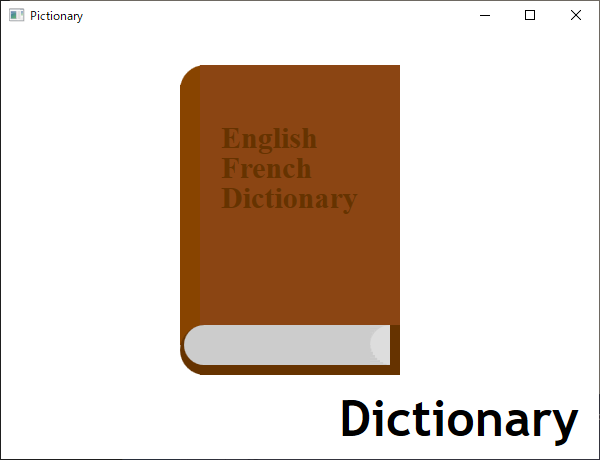

# Pictionary Project for Small Basic

## Purpose
- Small Basic is a programming language for kids.
- Little difficult to understand English keywords especially for non-native kids.
- This project suggests to draw pictures about keywords in Small Basic.

## Target Keywords

Target keywords are following 172 words - nouns, **verbs** and *others*.

1. *[And](../img/And2.png)* *Or* *For* Step *If* *Then* *Else* *While* **Go** *To* Subroutine
2. Array Clock Control Desktop Dictionary File Flickr Graphics Math Mouse Network Program Shape Sound Stack Text Timer Turtle Window
3. *Absolute* Angle Append Argument Background Bell Button Bold *Bound* Box Brush Caption Case Ceiling Character Chime Chinese Code Color Content Cosine Count Cursor Date Day Degree Definition Directory Ellipse English Error Floor Font French *From* German Height Hour Image Index Interval Italian Italic Item Japanese Key Korean *Last* Left Length Line *Lower* Logarithm *Natural* *Maximum* Message Millisecond *Minimum* Minute Month Music Name *Of* Opacity Page Paper Path Pen Pi Pixel Power Radian *Random* Remainder Rectangle RGB Right Root Second Sine Size Spanish Speed Square Tangent Title Top *Traditional* Triangle *Upper* Value Wall Web Week Width Year
4. **Add** **Animate** **Append** **Clear** **Click** **Convert** **Copy** **Create** **Delete** **Delay** **Download** **Draw** **Down** **Elapse** **Fill** **Get** **Hide** **Input** **Insert** **Move** **Pause** **Play** **Pop** **Push** **Read** **Remove** **Resize** **Resume** **Ring** **Rotate** **Round** **Set** **Show** **Simplify** **Stop** **Tick** **Turn** **Type** **Up** **Wait** **Write** **Zoom**
5. *Can* **Contain** **End** **Is** **Start**

## Format

- 1 card 1 picture 1 word
- a card is 598 x 428 pixels
- programed with Shapes as a Shapes_Init subroutine (can be converted to
SVG)

## Gallery

- [Pictionary for Small Basic](https://photos.google.com/share/AF1QipPK5jxBcHW8k3VRzNct1qr_yS258LEKRSlh-wqatw_a3qlGxImkljk896G4K_Sy0w?key=UUM5dTBGbmw2LTM2MllfWXlsUTF6ZnFvc2NlX3pB) (Google Photo)

## Repository

- [Pictionary for Small Basic](https://github.com/nonkitMac/Pictionary) (GitHub)
